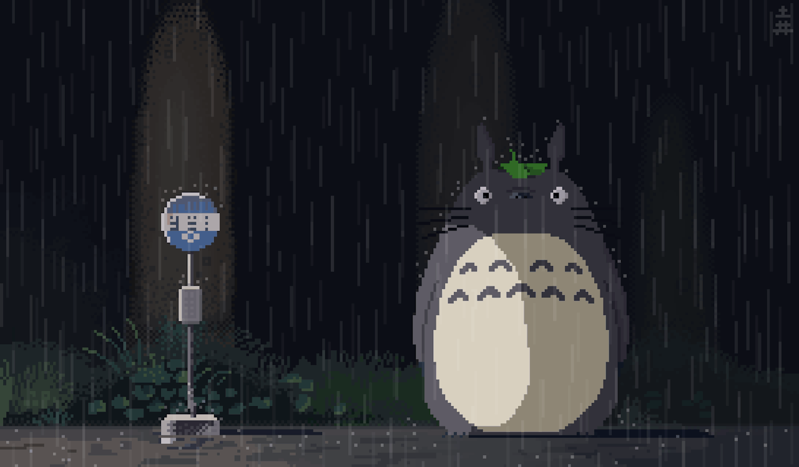
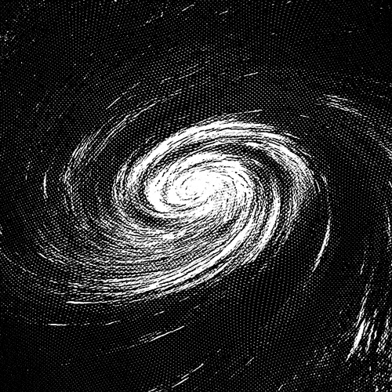

  

<h1 align="center">Ancore</h1>

  

  <code><b>USER:</b> Ancore222</code> | 
  <code><b>STATUS:</b> DISCOVERING</code> | 
  <code><b>THEME:</b> NEUTRAL_MINIMALISM</code>

---

### ★About Me★
Добро пожаловать. Это мой личный уголок на GitHub, где я собираю интересные решения и настраиваю свое рабочее пространство.

* **Интересы:** Изучение структуры проектов и визуальное оформление данных.
* **Стиль:** Минимализм и функциональность.
* **В планах:** Развитие репозиториев и освоение новых инструментов.

  

### 🛠 Стек инструментов
<table align="center" border="0">
  <tr>
    <td width="60%">
      <ul>
        <li><b>Git / GitHub</b> — управление проектами.</li>
        <li><b>Markdown</b> — оформление документации.</li>
        <li><b>Customization</b> — работа над стилем интерфейса.</li>
      </ul>
    </td>
    <td width="40%" align="center">
      
    </td>
  </tr>
</table>

---

  <code>Session Active. 2026</code>

