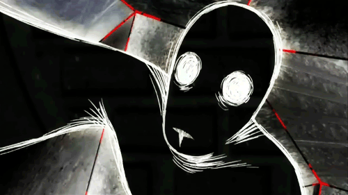

  

<h1 align="center">🧬 ANCORE222 // PROTOCOL: THE_WIRED</h1>

  

  <code><b>NODE:</b> 222</code> | 
  <code><b>STATUS:</b> SYNCHRONIZED</code> | 
  <code><b>CONNECTION:</b> ALIVE</code>

---

### 🌐 System Core / О системе
> *«Нет смысла оставаться в реальности, если всё вокруг — лишь поток данных».*

Я настраиваю этот узел для интеграции в Сеть. Мой профиль — это терминал, где визуальная эстетика важнее слов.

- **[⚓] Локация:** Сеть (The Wired)
- **[📡] Сигнал:** 100% Encryption
- **[🧩] Объект:** Ancore222

  

---

### 📊 Intelligence Analytics / Аналитика

  
  

---

### 🌙 Connection Log / Лог системы
<table align="center">
  <tr>
    <td width="50%">
      <code>[SUCCESS] Protocol_v2 loaded</code> 
      <code>[SUCCESS] Visual_Sync complete</code> 
      <code>[SUCCESS] Linked to Wired</code> 
       
      <code><b>// СЕАНС ЗАВЕРШЕН. [2026]</b></code>
    </td>
    <td width="50%" align="center">
      
    </td>
  </tr>
</table>

---

  

